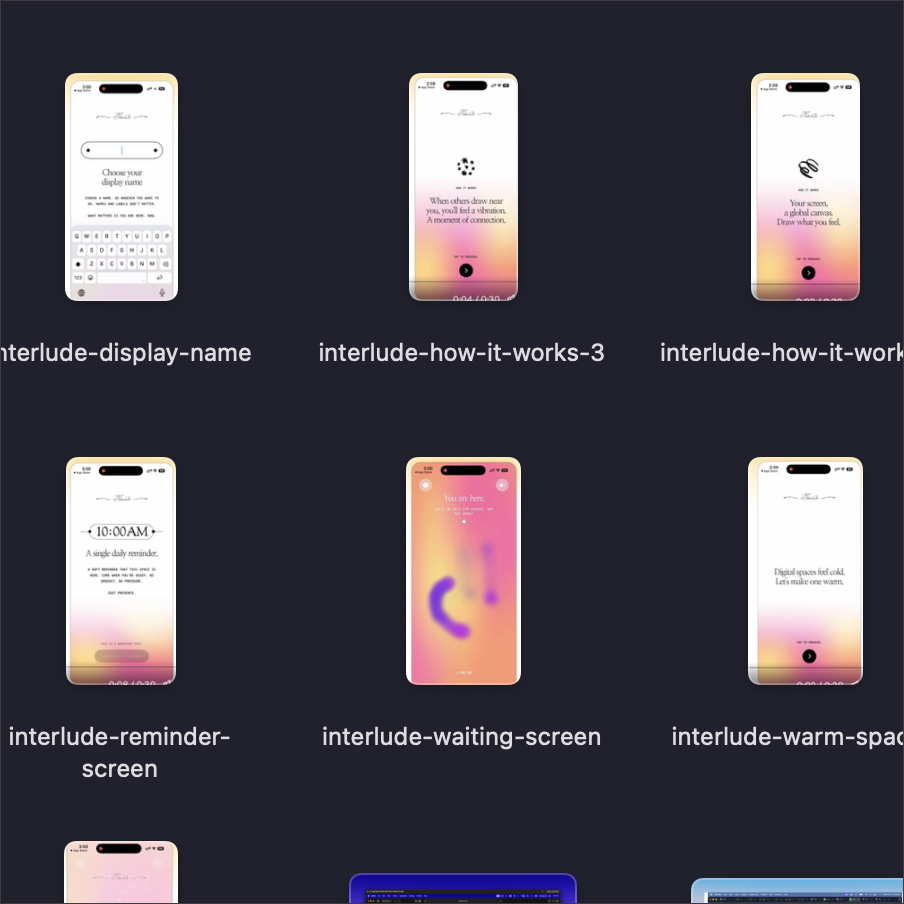

# Aayush's Homebrew Tap

```bash
brew tap aayush9029/tap
```

<p align="center">
  <a href="https://github.com/Aayush9029/apple-mail-exporter"></a>&nbsp;&nbsp;
  <a href="https://github.com/Aayush9029/findertags"></a>&nbsp;&nbsp;
  <a href="https://github.com/Aayush9029/nit"></a>&nbsp;&nbsp;
  <a href="https://github.com/Aayush9029/noz"></a>&nbsp;&nbsp;
  <a href="https://github.com/Aayush9029/peek"></a>
</p>

**[apple-mail-exporter](https://github.com/Aayush9029/apple-mail-exporter)** — Search and export emails from Apple Mail's local database
```
brew install aayush9029/tap/apple-mail-exporter
```

**[findertags](https://github.com/Aayush9029/findertags)** — Read and modify Finder tags from the command line
```
brew install aayush9029/tap/findertags
```

**[nit](https://github.com/Aayush9029/nit)** — Browse tweets from the terminal via Nitter instances
```
brew install aayush9029/tap/nit
```

**[noz](https://github.com/Aayush9029/noz)** — Prevent Mac from sleeping with lid closed
```
brew install aayush9029/tap/noz
```

**[peek](https://github.com/Aayush9029/peek)** — Identify and name images using vision LLMs
```
brew install aayush9029/tap/peek
```

---

### Skills

This repo also ships [Claude Code skills](https://skills.sh) for each tool.

```bash
npx skills add Aayush9029/homebrew-tap
```
