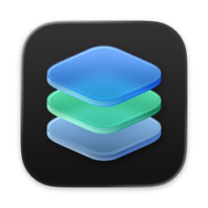
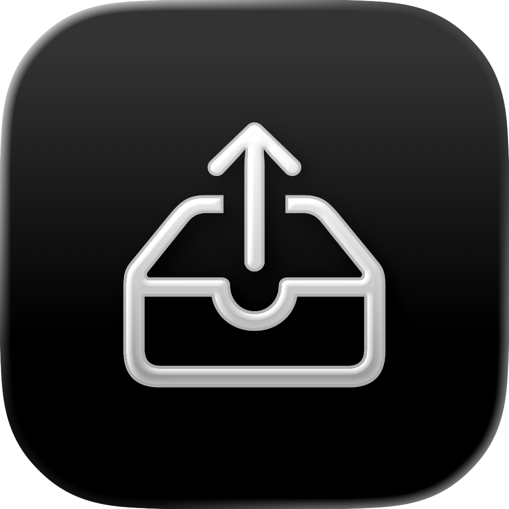
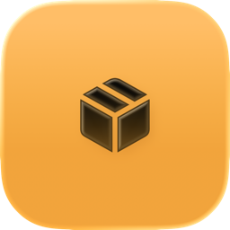
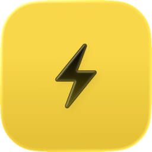

# Aayush's Homebrew Tap

```bash
brew tap aayush9029/tap
```

---

<a href="https://github.com/Aayush9029/apple-mail-exporter"></a>

### [apple-mail-exporter](https://github.com/Aayush9029/apple-mail-exporter)

Search and export emails from Apple Mail's local database

```
brew install aayush9029/tap/apple-mail-exporter
```

<br clear="left">

---

<a href="https://github.com/Aayush9029/bump"></a>

### [bump](https://github.com/Aayush9029/bump)

Bump Xcode project marketing version

```
brew install aayush9029/tap/bump
```

<br clear="left">

---

<a href="https://github.com/Aayush9029/doq"></a>

### [doq](https://github.com/Aayush9029/doq)

Query Apple developer documentation from your terminal

```
brew install aayush9029/tap/doq
```

<br clear="left">

---

<a href="https://github.com/Aayush9029/findertags"></a>

### [findertags](https://github.com/Aayush9029/findertags)

Read and modify Finder tags from the command line

```
brew install aayush9029/tap/findertags
```

<br clear="left">

---

<a href="https://github.com/Aayush9029/goping"></a>

### [goping](https://github.com/Aayush9029/goping)

Thoughtful ping with a live TUI and better host stats

```
brew install aayush9029/tap/goping
```

<br clear="left">

---

<a href="https://github.com/Aayush9029/hn"></a>

### [hn](https://github.com/Aayush9029/hn)

Browse Hacker News from the terminal — CLI + interactive TUI

```
brew install aayush9029/tap/hn
```

<br clear="left">

---

<a href="https://github.com/Aayush9029/icn"></a>

### [icn](https://github.com/Aayush9029/icn)

Generate .icon files from SF Symbols for Apple platforms

```
brew install aayush9029/tap/icn
```

<br clear="left">

---

<a href="https://github.com/Aayush9029/loca"></a>

### [loca](https://github.com/Aayush9029/loca)

Get your Mac's current location from the terminal

```
brew install aayush9029/tap/loca
```

<br clear="left">

---

<a href="https://github.com/Aayush9029/meow"></a>

### [meow](https://github.com/Aayush9029/meow)

Upload files to catbox.moe & litterbox from the terminal

```
brew install aayush9029/tap/meow
```

<br clear="left">

---

<a href="https://github.com/Aayush9029/nit"></a>

### [nit](https://github.com/Aayush9029/nit)

Browse tweets from the terminal via Nitter instances

```
brew install aayush9029/tap/nit
```

<br clear="left">

---

<a href="https://github.com/Aayush9029/noz"></a>

### [noz](https://github.com/Aayush9029/noz)

Prevent Mac from sleeping with lid closed

```
brew install aayush9029/tap/noz
```

<br clear="left">

---

<a href="https://github.com/Aayush9029/peek"></a>

### [peek](https://github.com/Aayush9029/peek)

Describe and rename images using vision LLMs

```
brew install aayush9029/tap/peek
```

<br clear="left">

---

<a href="https://github.com/Aayush9029/sip"></a>

### [sip](https://github.com/Aayush9029/sip)

Summarize stdin using LLMs

```
brew install aayush9029/tap/sip
```

<br clear="left">

---

<a href="https://github.com/Aayush9029/spu"></a>

### [spu](https://github.com/Aayush9029/spu)

Check and update Swift package dependencies

```
brew install aayush9029/tap/spu
```

<br clear="left">

---

<a href="https://github.com/Aayush9029/watts"></a>

### [watts](https://github.com/Aayush9029/watts)

Background battery and power logger for macOS

```
brew install aayush9029/tap/watts
```

<br clear="left">

---

<a href="https://github.com/Aayush9029/tmail"></a>

### [tmail](https://github.com/Aayush9029/tmail)

Disposable email in your terminal

```
brew install aayush9029/tap/tmail
```

<br clear="left">

---

<a href="https://github.com/Aayush9029/wiki"></a>

### [wiki](https://github.com/Aayush9029/wiki)

Search and read Wikipedia from your terminal

```
brew install aayush9029/tap/wiki
```

<br clear="left">

---

## Skills

This repo also ships [Agent Skills](https://skills.sh) for each tool.

Available skills: `apple-mail-exporter`, `bump`, `doq`, `findertags`, `goping`, `hn`, `icn`, `loca`, `meow`, `nit`, `noz`, `peek`, `sip`, `spu`, `tmail`, `watts`, `wiki`.

```bash
npx skills add Aayush9029/homebrew-tap
```
